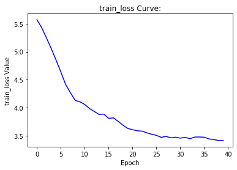

# Trigger Tasks Report GSoC 2020

This is the technicle report of the evaluation task of the GSoC 2020 project Deep Learning Algorithms for Muon Momentum Estimation in the CMS Trigger System provided by CMS at CERN.

In this task, I 
1. implmented Fully Connect Network (FCN), Convolutional Neural Network (CNN, ResNet, specifally) and a simple linear regression model to predict the energy level of [given particle dataset](https://www.dropbox.com/s/c1pzdacnzhvi6pm/histos_tba.20.npz?dl=0);
2. then reconstructed the feature of particle into a image-like 2D array and, again, fed as dataset to train ResNet;
3. implmented and testing Message Passing Neural Network (MPNN) in a quark/gulon classifier.

## Task 1

### Dataset Prepartion

The [given dataset](https://www.dropbox.com/s/c1pzdacnzhvi6pm/histos_tba.20.npz?dl=0) contains sparse feature matrix including multiple NaN values, so I first set them to `0` and normalized the feature matrix into a `mean=0, std=1` matrix. You can find it in task1.ipynb ### Explore Dataset and Standardization.

Also, the `q/pt` coloum in the `parameter` indicates the **momentum of particle**, which can be calcualte from `pt=1/(q/pt)` (since `q=+-1`). And thus I yeild the momentum of particle (as well as their classes of energy). Noteworthy, the eta and phi angle coloums are dropped.

Meanwhile, during the exploration, I find that the dataset is extremaly unbalance - up to 97% of particle has an energy of `0-10GeV`. I upsampled the remaining 3% dataset (by dupulate them simply) and drop some of the class zero (`0-10GeV`) to control the size of the whole dataset. Finally, the whole dataset contains 4 million particles, with around 1 million in each class. You can find it in task1.ipynb ### Upsampling Biased Dataset.

### Dataloader and Dataset

I implmented a `MuonDataset` and a batch-based dataloader of the `MuonDataset`. You can find it in task1.ipynb ### Data Loader. So, the comsumption of RAM in training process is reduced. 

The feature of a partcle is a `[87, 1]`array in `tensor.float`,while the label is a sclar (`0, 1, 2, 3`) in `tensor.long` . The training set includes `3000000` particles and the test set has `957571`particles.

### Fully Connected Net

At the very beginning, I implented a simple FCN as the base line model. It contains 3 linear layers followed by batch normalization layers. `ReLU` is served as the activation function.  The structure of my FCN is shown as followed.

```
FCNetwork(
  (fc1): Linear(in_features=87, out_features=100, bias=True)
  (bn1): BatchNorm1d(100, eps=1e-05, momentum=0.1, affine=True, track_running_stats=True)
  (fc2): Linear(in_features=100, out_features=100, bias=True)
  (bn2): BatchNorm1d(100, eps=1e-05, momentum=0.1, affine=True, track_running_stats=True)
  (fc3): Linear(in_features=100, out_features=100, bias=True)
  (bn3): BatchNorm1d(100, eps=1e-05, momentum=0.1, affine=True, track_running_stats=True)
  (predict): Linear(in_features=100, out_features=4, bias=True)
)
```

I choose `SGD` as the optimizer and   `CrossEntropyLoss` as the loss function. A more detailed hyperparameter list is shown.

```
num_epochs = 10
batch_size = 256
lr = 0.1
device='cpu'
lossFunction = nn.CrossEntropyLoss()
model = FCNetwork(87, 100, 4)
optimizer = optim.SGD(model.parameters(), lr=lr, momentum=0.9, weight_decay=5e-4)
```

The FCN classifier reached an accuracy of 51.584% in test set, with a loss at `1.189`. The train/test loss curves and the outout of the last epoch are shown. The y-axis value should be divided by the batch size. 

```
Epoch: 9
Train loss: 1.201 | Train Acc: 49.950% (1498494/3000000)
Test Loss: 1.189  | Test Acc: 51.584% (493958/957571)
```




### CNN

I implmented a ResNet in this part.  The detail of my implmentation is shown in task1.ipynb ### CNN. The CNN contains residual block with two `3*3` conv layers. And this ResNet involves three layers with two residual block (ResNet-16). The detail information of the net is shown. Noteworthy, I reconstructed the feature array into a 2D array.

```
ResNet(
  (conv): Conv2d(1, 16, kernel_size=(3, 3), stride=(1, 1), padding=(1, 1), bias=False)
  (bn): BatchNorm2d(16, eps=1e-05, momentum=0.1, affine=True, track_running_stats=True)
  (relu): ReLU(inplace=True)
  (layer1): Sequential(
    (0): ResidualBlock(
      (conv1): Conv2d(16, 16, kernel_size=(3, 3), stride=(1, 1), padding=(1, 1), bias=False)
      (bn1): BatchNorm2d(16, eps=1e-05, momentum=0.1, affine=True, track_running_stats=True)
      (relu): ReLU(inplace=True)
      (conv2): Conv2d(16, 16, kernel_size=(3, 3), stride=(1, 1), padding=(1, 1), bias=False)
      (bn2): BatchNorm2d(16, eps=1e-05, momentum=0.1, affine=True, track_running_stats=True)
    )
    (1): ResidualBlock(
      (conv1): Conv2d(16, 16, kernel_size=(3, 3), stride=(1, 1), padding=(1, 1), bias=False)
      (bn1): BatchNorm2d(16, eps=1e-05, momentum=0.1, affine=True, track_running_stats=True)
      (relu): ReLU(inplace=True)
      (conv2): Conv2d(16, 16, kernel_size=(3, 3), stride=(1, 1), padding=(1, 1), bias=False)
      (bn2): BatchNorm2d(16, eps=1e-05, momentum=0.1, affine=True, track_running_stats=True)
    )
  )
  (layer2): Sequential(
    (0): ResidualBlock(
      (conv1): Conv2d(16, 32, kernel_size=(3, 3), stride=(2, 2), padding=(1, 1), bias=False)
      (bn1): BatchNorm2d(32, eps=1e-05, momentum=0.1, affine=True, track_running_stats=True)
      (relu): ReLU(inplace=True)
      (conv2): Conv2d(32, 32, kernel_size=(3, 3), stride=(1, 1), padding=(1, 1), bias=False)
      (bn2): BatchNorm2d(32, eps=1e-05, momentum=0.1, affine=True, track_running_stats=True)
      (downsample): Sequential(
        (0): Conv2d(16, 32, kernel_size=(3, 3), stride=(2, 2), padding=(1, 1), bias=False)
        (1): BatchNorm2d(32, eps=1e-05, momentum=0.1, affine=True, track_running_stats=True)
      )
    )
    (1): ResidualBlock(
      (conv1): Conv2d(32, 32, kernel_size=(3, 3), stride=(1, 1), padding=(1, 1), bias=False)
      (bn1): BatchNorm2d(32, eps=1e-05, momentum=0.1, affine=True, track_running_stats=True)
      (relu): ReLU(inplace=True)
      (conv2): Conv2d(32, 32, kernel_size=(3, 3), stride=(1, 1), padding=(1, 1), bias=False)
      (bn2): BatchNorm2d(32, eps=1e-05, momentum=0.1, affine=True, track_running_stats=True)
    )
  )
  (layer3): Sequential(
    (0): ResidualBlock(
      (conv1): Conv2d(32, 64, kernel_size=(3, 3), stride=(2, 2), padding=(1, 1), bias=False)
      (bn1): BatchNorm2d(64, eps=1e-05, momentum=0.1, affine=True, track_running_stats=True)
      (relu): ReLU(inplace=True)
      (conv2): Conv2d(64, 64, kernel_size=(3, 3), stride=(1, 1), padding=(1, 1), bias=False)
      (bn2): BatchNorm2d(64, eps=1e-05, momentum=0.1, affine=True, track_running_stats=True)
      (downsample): Sequential(
        (0): Conv2d(32, 64, kernel_size=(3, 3), stride=(2, 2), padding=(1, 1), bias=False)
        (1): BatchNorm2d(64, eps=1e-05, momentum=0.1, affine=True, track_running_stats=True)
      )
    )
    (1): ResidualBlock(
      (conv1): Conv2d(64, 64, kernel_size=(3, 3), stride=(1, 1), padding=(1, 1), bias=False)
      (bn1): BatchNorm2d(64, eps=1e-05, momentum=0.1, affine=True, track_running_stats=True)
      (relu): ReLU(inplace=True)
      (conv2): Conv2d(64, 64, kernel_size=(3, 3), stride=(1, 1), padding=(1, 1), bias=False)
      (bn2): BatchNorm2d(64, eps=1e-05, momentum=0.1, affine=True, track_running_stats=True)
    )
  )
  (avg_pool): AvgPool2d(kernel_size=8, stride=8, padding=0)
  (fc): Linear(in_features=64, out_features=4, bias=True)
)
```

I choose `Adam` as the optimizer and   `CrossEntropyLoss` as the loss function. A more detailed hyperparameter list is shown.

```
batch_size = 256
num_epochs = 10
lossFunction = nn.CrossEntropyLoss()
lr = 0.001
device = 'cpu'
optimizer = torch.optim.Adam(resnet.parameters(), lr=lr)
```

The ResNet-16 classifier reached an accuracy of 86.744% in test set, with a loss at `0.349`. The train/test loss curves and the outout of the last epoch are shown.  Obviously, the net has not reached its best performance, but due to time and computational resources limitation, I did not increase the `num_epochs`.

```
Epoch: 9
Train loss: 0.353 | Train Acc: 86.448% (2593449/3000000)
Test Loss: 0.349  | Test Acc: 86.744% (830639/957571)
```


### Regression

Here I use one linear layer in pytorch to act as the the regression model.

```
model = nn.Linear(87, 1)
```

Its hyperparameter is exactly the same as the ResNet classifier. However, it failed to obtain any feature by regressing directly from `pt`. Its loss curves are shown. The loss is calculated by `MSE loss`.


## Task 2

I mainly reconstructed the feature in task 2. As I stated above, I reshape the feature into a 2D array to feed the ResNet16. And I move further here by constructing it into a `1*32*32` one channel image by reshaping and padding.

```
img_like_feature = np.pad(np.reshape(b, (10,10)), (11, 11), 'reflect') # from [87*1] to [32*32]
```

Here is an example of the `img_like_feature` I constructed:


Again, I use ResNet-16 to fit the dataset, with  `Adam` as the optimizer and   `CrossEntropyLoss` as the loss function. The full hyperparameters are:

```
batch_size = 256
num_epochs = 2
lossFunction = nn.CrossEntropyLoss()
lr = 0.001
device = 'cpu'
optimizer = torch.optim.Adam(resnet.parameters(), lr=lr)
```

Pitfully, I do not have enough RAM to fine tune this model at a considerable epoch number, but it has the same trend as the ResNEt-16 in task 1.

```
Epoch: 0
Train loss: 0.917 | Train Acc: 56.830% (1704886/3000000)
Test Loss: 0.795  | Test Acc: 64.117% (613966/957571)

Epoch: 1
Train loss: 0.718 | Train Acc: 68.462% (2053859/3000000)
Test Loss: 0.670  | Test Acc: 70.886% (678782/957571)
```

## Task3

In this section, I build graph by hand-craft feature and KNN algorithm, and feed the graph dataset to the MPNN-based Quark/Gluon jet classifier.

### Hand-crafted Feature and KNN-based Graph Construction

The full jet dataset is giant and I cannot afford such an amount of RAM, so I only take the fitst file (100,000 jets) as my dataset. 

I notice that there are 14 type of `pdgid` in total and each jet no jets share the same number and type of `pdgid`. So, I calculate the type and number of `pdgid` of each jet (as a `14*1` array) and set them as a part of the feature of jet. Then I notice that the average pt is also a siginificant metric to tell the type of jet, and thus the average pt is taken into account. The hand-crafted feature is constructed by `[average_pt, pdgid_type_and_number_list]` (`15*1` array).

Then, I applied KNN algorithm to tell which K jets share the greatest similarity with each other.  The following `[100000*5]` list shows the neibours of each ject.

```
[[    0 17064 70444 11236 28423]
 [    1 53533 28137 21976 90660]
 [    2 99448 28005 32533 74298]
 ...
 [99997  3746  8665  4528 15614]
 [99998 15210 42989 42878 83043]
 [99999  1754 24424 64312 84631]]
```

### QG Jet Dataset

With the adjacent matrix, I build the QG jet dataset. The data structure of QG Jet Dataset is decribed as followed:

```
data = Data(x=feature.view(100000, -1), edge_index=adjacent_matrix.view(2,-1), y=label)
```

### MPNN

I implment the SEGAConv layer in my MPNN. The network structure is as followed.

```
MPNNet(
  (fc0): Linear(in_features=556, out_features=128, bias=True)
  (conv1): SAGEConv(
    (fc): Linear(in_features=128, out_features=128, bias=True)
    (act): ReLU()
    (update_fc): Linear(in_features=256, out_features=128, bias=False)
    (update_act): ReLU()
  )
  (conv2): SAGEConv(
    (fc): Linear(in_features=128, out_features=128, bias=True)
    (act): ReLU()
    (update_fc): Linear(in_features=256, out_features=128, bias=False)
    (update_act): ReLU()
  )
  (conv3): SAGEConv(
    (fc): Linear(in_features=128, out_features=128, bias=True)
    (act): ReLU()
    (update_fc): Linear(in_features=256, out_features=128, bias=False)
    (update_act): ReLU()
  )
  (fc1): Linear(in_features=256, out_features=128, bias=True)
  (fc2): Linear(in_features=128, out_features=64, bias=True)
  (fc3): Linear(in_features=64, out_features=1, bias=True)
  (act1): ReLU()
  (act2): ReLU()
)
```

And the hyperparameter is 

```
num_epochs = 10
batch_size = 256
lr = 0.01
device='cpu'
lossFunction = nn.BCELoss()
optimizer = torch.optim.Adam(model.parameters(), lr=lr, weight_decay=5e-4)
```

. However, the network failed to learn from the dataset, and it always predicts jets as `label:0`

## Optional

TBD
